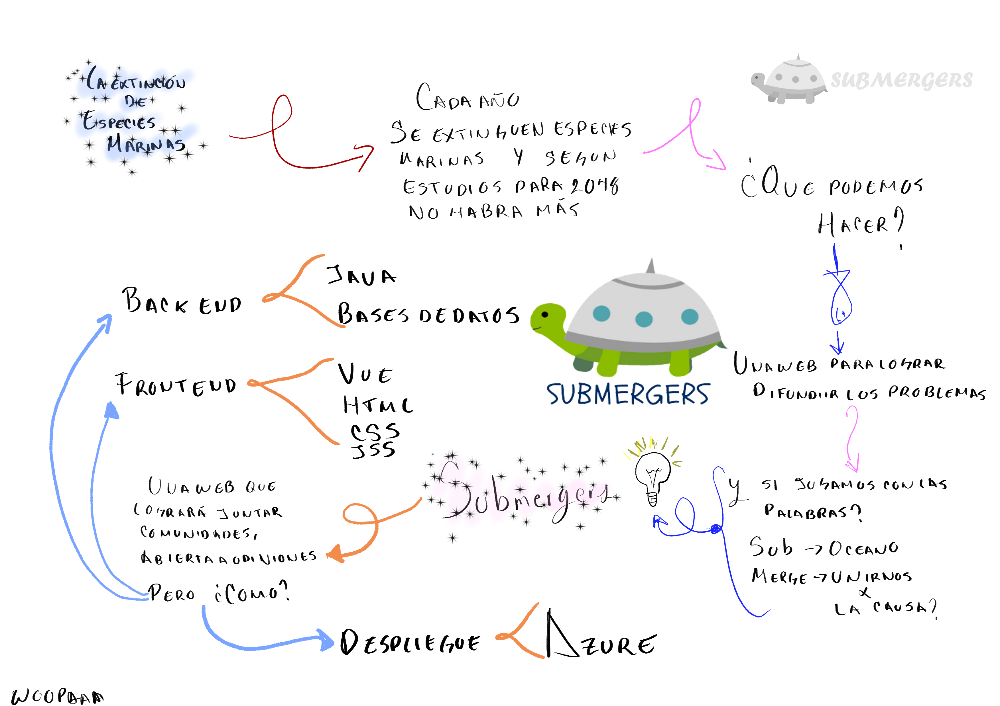

# <h1> The Submergers </h1>

The submergers es una idea que surgió con el fin de buscar una solución a un problema como lo son las especies en peligro de extinción.
Lo que busca The submergers es crear una conciencia sobre las especies mediante una página web donde se muestren datos, y en un futuro se puedan crear estadisticas de los usuarios, estadisticas básicas como saber si reciclan materiales, o si concoen de fudaciones que ayuden a estas especies.

El proyecto se encuentra actualmente desplegado en:
    <a href="https://jolly-plant-0f4e62410.1.azurestaticapps.net/">The submergers Website</a>
<h2>Info del proyecto </h2>

Para descargar el proyecto desde git y correrlo de manera local 
Realiza un fork del proyecto y ejecuta los siguientes comandos en terminal 
```
git clone https://github.com/JoseLuisMonroy/The_Submergers
```
```

se agrega link donde se realizó la práctica de base de datos con JAVA, CONTENEDOR DOCKER, JPA.

```
https://github.com/EliStgoManz/JPA-hibernate--Java-docker
```
```

cd The_Submergers
```
```
npm install
```
```
npm run dev
```
Y ejecuta el link 
```
http://localhost:5050/ 
```
en tu navegador preferido

<h2>Tecnologias empleadas</h2>
Para el front end se decidió usar el framework de vuejs, en el desplegue de la web se emplean los servicios de Microsotf Azure, y debido a la versatilidad y tiempo se optó por el servicio de paginas web estaticas.
Para la parte de Back se usará Java.

<h3>Diagrama de solución</h3>

